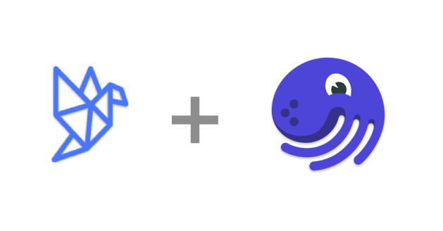
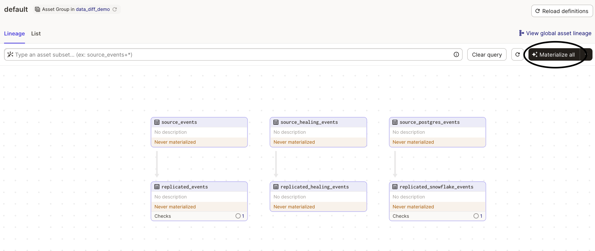
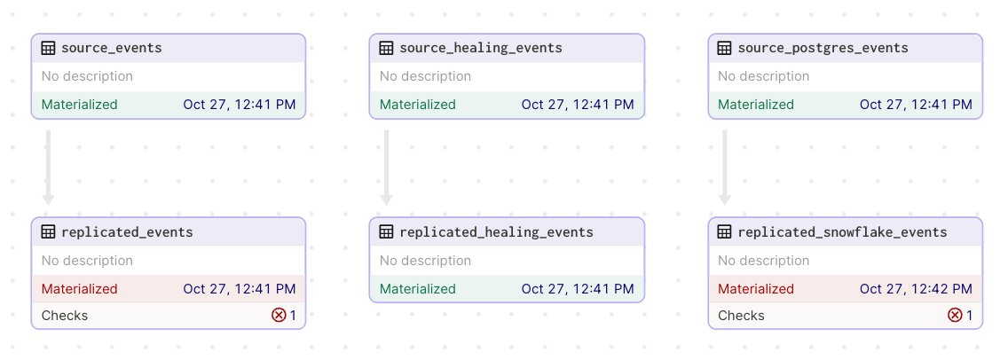
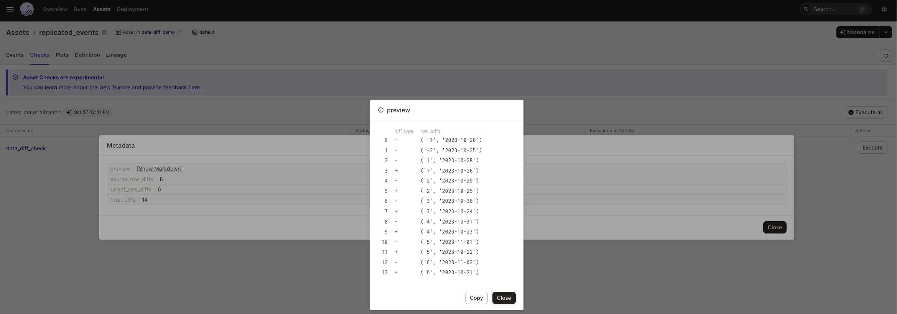

# Datafold + Dagster: Better Together

<p align="center">
  
</p>

This is a demo project for the Dagster + Datafold integration using [`data-diff`](https://github.com/datafold/data-diff#data-diff-compare-datasets-fast-within-or-across-sql-databases). The goal is to give you clear examples of how to use Dagster's [asset checks](https://docs.dagster.io/concepts/assets/asset-checks) to solve data replication problems in your data pipelines by validating the data diff between the source and target tables.

Learn more about Datafold: [here](https://www.datafold.com/data-replication)

Learn more about Dagster: [here](https://dagster.io/)

TODO: Add public loom video with gif thumbnail

## Setup

```bash
# setup python dependencies
cd data-diff-demo
python -m venv venv
source venv/bin/activate
pip install --upgrade pip
pip install -e ".[dev]"
source venv/bin/activate
```

```
# define environment variables in a .env file in this directory: data-diff-demo/data_diff_demo/.env
# placeholder examples below for postgres and snowflake

SOURCE_DATABASE_HOST="ep-shrill-meadow-043325.us-west-2.aws.neon.tech"
SOURCE_DATABASE_PORT="5432"
SOURCE_DATABASE_NAME="neondb"
SOURCE_DATABASE_USER="sungwonchung3"
SOURCE_DATABASE_PASSWORD="asdfasdfasdf"
DESTINATION_SNOWFLAKE_ACCOUNT="ASDFASDFASDF"
DESTINATION_SNOWFLAKE_USER="sung"
DESTINATION_SNOWFLAKE_PASSWORD="ASDFASDFASDF"
DESTINATION_SNOWFLAKE_WAREHOUSE="INTEGRATION"
DESTINATION_SNOWFLAKE_DATABASE="DEMO"
DESTINATION_SNOWFLAKE_SCHEMA="DBT_SUNG"
DESTINATION_SNOWFLAKE_ROLE="DEMO_ROLE"
```

```bash
# start dagster development server
dagster dev
```

Open http://localhost:3000 in your browser

Click `Materialize all` in the top right corner of the Dagster UI to materialize all assets



You should see the following assets materialized with 2 asset checks intentionally failed



When you click to view the asset check metadata, you should see the following output



Now apply this template project to your own Dagster project and start using `data-diff` to validate real data pipelines!


## Interpreting the Data Diff Output

`-`: original rows in source

`+`: new/additional rows in target

In this example, there are 2 source rows that do not exist in the target table.

`-   ('-1', '2023-10-23')`

`-   ('-2', '2023-10-22')`

Example of source row modified in target table:

`-   ('1', '2023-10-25')`

`+   ('1', '2023-10-23')`

