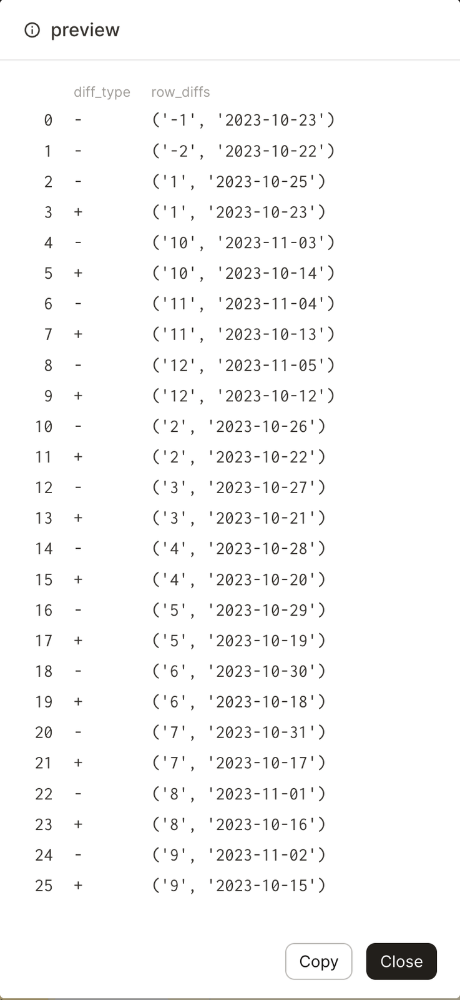

# dagster-data-diff-demo
Dagster + Datafold: Better Together

This is a demo project for the Dagster + data-diff integration. Its goal is to give you clear examples of how to use Dagster's asset checks to solve source to target replication problems in your data pipelines.

## Setup

```bash
# setup python dependencies
cd data-diff-demo
python -m venv venv
source venv/bin/activate
pip install --upgrade pip
pip install -e ".[dev]"
source venv/bin/activate
```

```bash
# start dagster development server
dagster dev
```

TODO: add GIF on materializing all assets and clicking through UI

"-": original rows in source
"+": new/additional rows in target

In this example, there are 2 source rows that do not exist in the target table.

`-   ('-1', '2023-10-23')`

`-   ('-2', '2023-10-22')`

Example of source row modified in target table:

`-   ('1', '2023-10-25')`

`+   ('1', '2023-10-23')`

